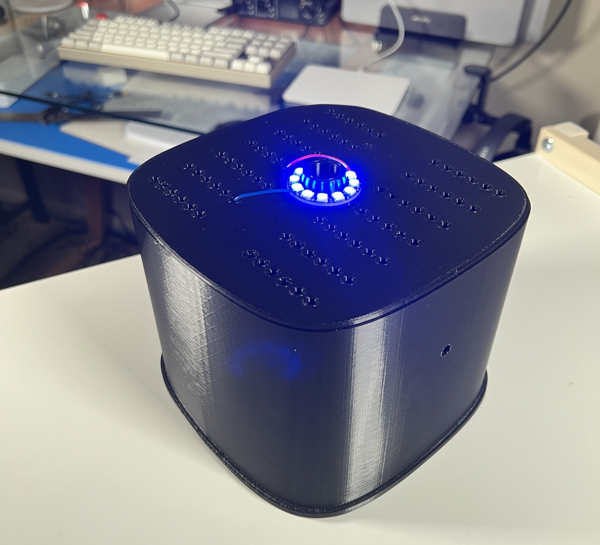

# ChatGPT Smart Speaker
A quick weekend project to build a smart speaker using ChatGPT. This is just a proof of concept and not "production ready."

## BOM
* Raspberry Pi 4
* USB Microphone
* USB Speaker
  
## Some Additional Notes
You need to be running an 64 bit OS on the Raspberry Pi. This is so playwright (the library which ChatGPI CLI is utilizing) will work. 

Install Mpg123 to play the audio files:

`sudo apt-get install mpg123`

If you don't want to use Google tech to speech, you can use the espeak library

`sudo apt install espeak`

